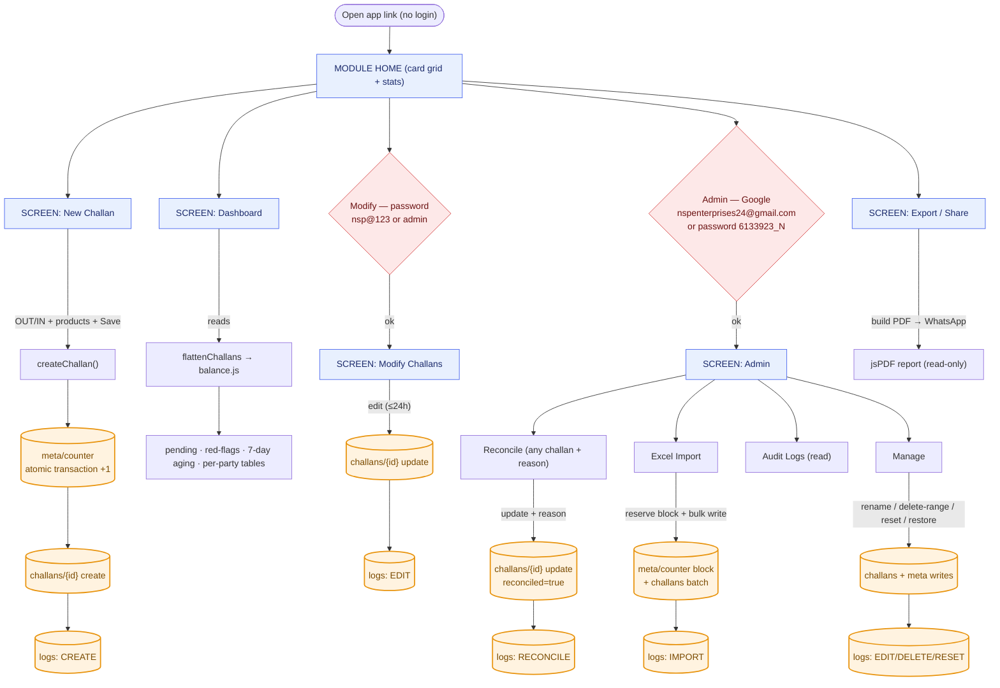
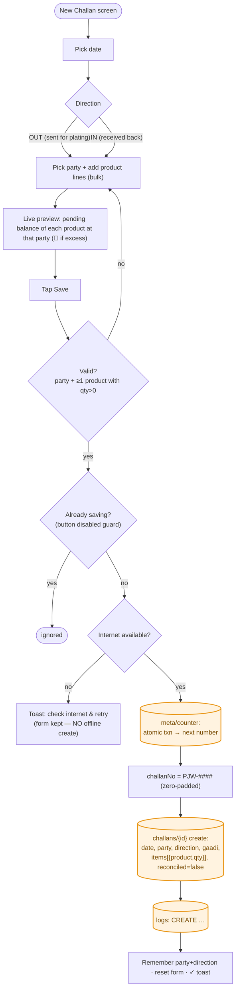
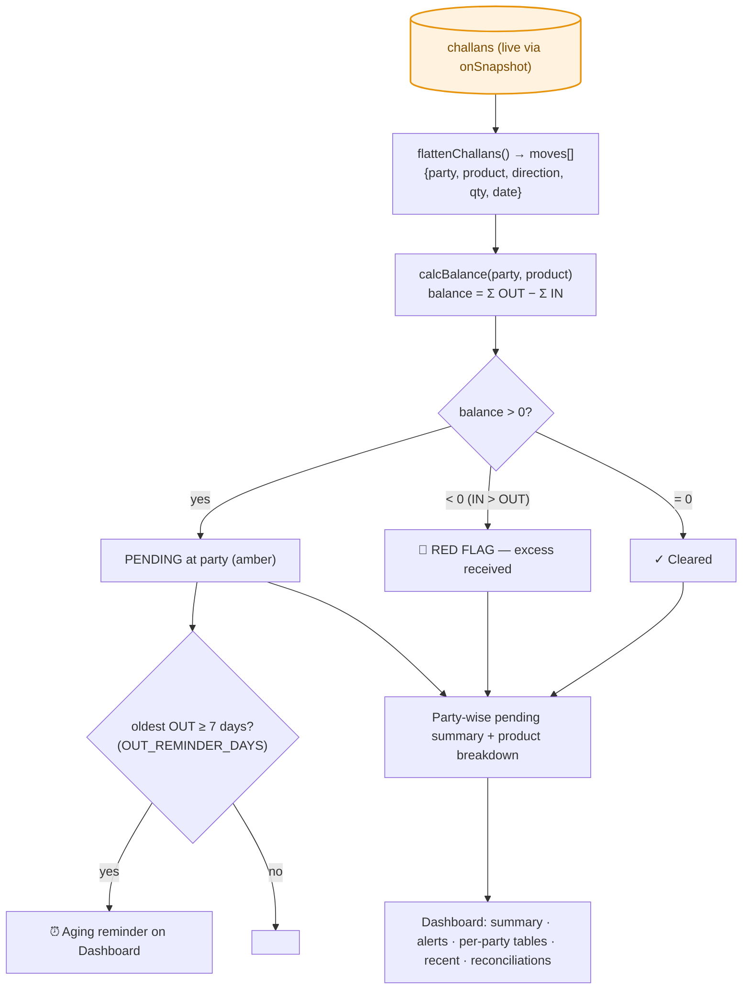
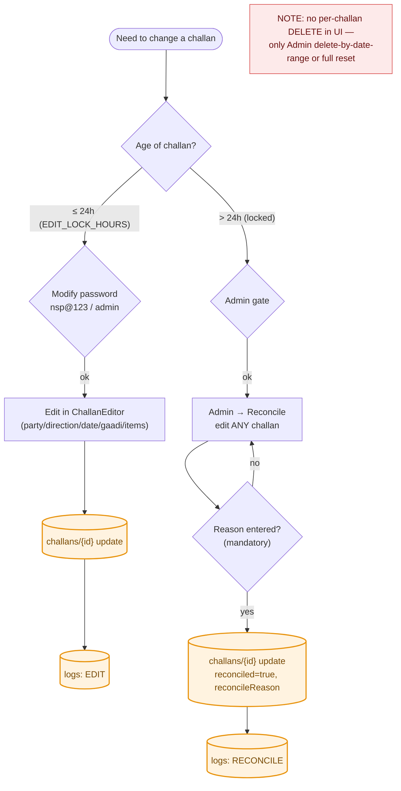
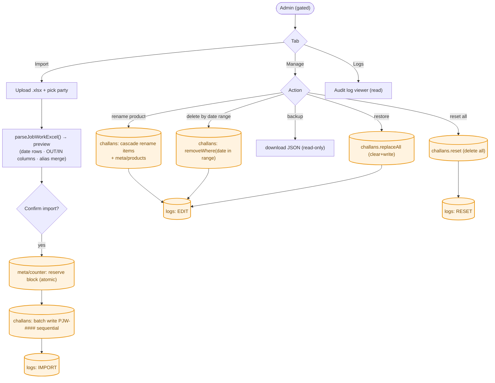
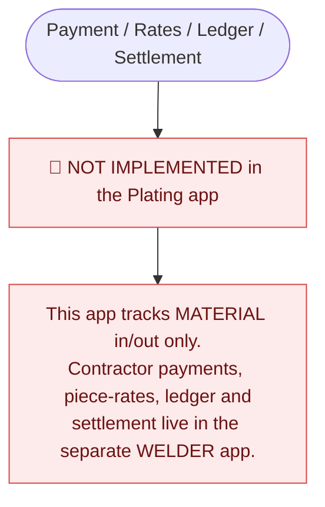
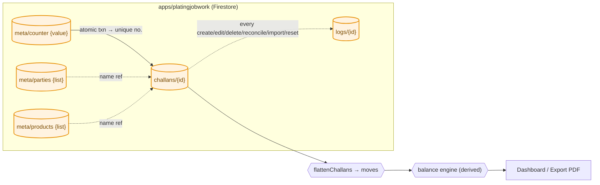

# UNICO Plating Job Work — Workflow Flowcharts (Mermaid)

> ACTUAL implemented logic only (code read 2026-06-08). Database writes are shown
> in **orange** `[( )]`. Firestore collections live under `apps/platingjobwork/`.
> 🔴 = not implemented in this app.

---

## 1. Master flow — open → screens → actions → DB writes

---

## 2. Challan flow (OUT) + Receive-back flow (IN) — the Save sequence

> OUT and IN are **independent challans** — there is no challan-to-challan return matching. Reconciliation is by the **net balance per party+product** (see §3).

---

## 3. Automation — balance / shortage / alerts (all derived)

---

## 4. Edit / 24h-lock / reconcile flow

---

## 5. Admin — import / manage flows

---

## 6. Payment flow

---

## 7. Database collections & data flow

---

### Legend
- 🟧 Orange `[( )]` = a Firestore write under `apps/platingjobwork/`.
- 🟦 Blue = screen · 🟥 Red = a gate or a not-implemented item.
- "Derived" = computed live from challans, never stored twice.
- Reflects the code on **2026-06-08**. Note: creating a challan **requires internet** (server-issued atomic number); the app is not offline-capable.
